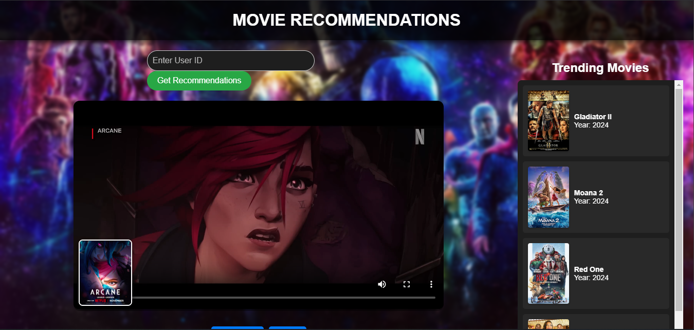
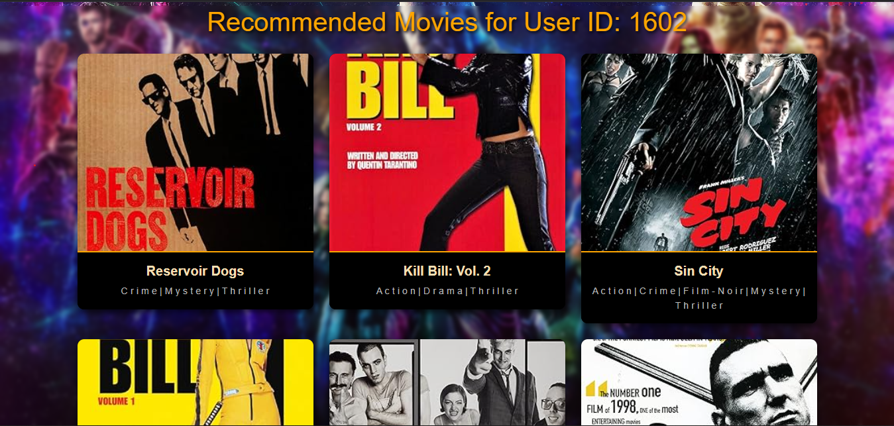

# 🎬 Movie Recommendation System

A python collaborative movie recommendation system with a simple web interface. This project uses Flask for the backend, integrates with the OMDb API for movie data, and leverages Bootstrap for responsive design. Users can enjoy browsing trending movies and personalized recommendations with an intuitive interface.

## 🚀 Features

- **Personalized Recommendations**: Get movie recommendations based on a specific user ID.
- **Trending Movies Section**: Displays a curated list of trending movies fetched from the OMDb API.
- **Search Functionality**: Search for movies by title.
- **Video Previews**: Watch trailers of selected movies directly on the page.
- **Modern UI**: Aesthetic design with a dynamic background, card-style layouts, and responsive components.
- **Interactive Navigation**: Easily switch between pages and explore movie details.


## 🛠️ Installation & Setup

1. **Clone the repository:**
   ```bash
   git clone https://github.com/yourusername/movie-recommendation.git
   cd movie-recommendation
2. **Install Dependencies
   ```bash
   pip install -r requirements.txt
3. **Set up the OMDb API key:

- Obtain an API key from OMDb API.
- Replace YOUR_API_KEY in app.py with your actual key.
4. ** Run the flask app
  ```bash
  flask run
5. **Run and interact with the recommendation Engine
-** the actual recommendation engine is in the recommender.ipynb jupyter notebook
## 📜 Usage

### Homepage
- Displays a search bar and trending movies fetched from the OMDb API.

### Recommendations Page
- Displays a personalized list of movie recommendations for a given user ID.
- Movies are displayed with posters, titles, and genres.

### Movie Trailer Feature
- Watch trailers for featured movies by interacting with video controls.

---

## 📸 Screenshots

### Homepage
 

### Recommendations Page
 

---

## 🛠️ Technologies Used
- **Backend**: Flask (Python)
- **Frontend**: HTML, CSS, Bootstrap
- **API**: OMDb API for movie data
- **Styling Enhancements**: Backdrop blur, dynamic thumbnails, card layouts

---

## 🎯 Future Enhancements
- improve page layouts 
- Implement a deep learning recommendation engine

## 🙌 Acknowledgments
- [OMDb API](http://www.omdbapi.com/) for providing movie data.
- [Bootstrap](https://getbootstrap.com/) for responsive design.


